# Database Documentation — SupervisEx (finalyearms)

Reference for the current database schema, generated from
`backend/database/migrations/*` on the **main** branch.

## Current state (at a glance)

- **Laravel 13 + PHP 8.3+ JSON API**, one relational database per deployment.
- **Auth:** Laravel Sanctum (bearer tokens) — `personal_access_tokens`.
- **RBAC:** 5 assignable roles — `institution_admin`, `coordinator`,
  `supervisor`, `student`, `employer` — stored in `roles`, linked via
  `users.role_id`, enforced by `can:<permission>` route middleware against the
  matrix in `config/rbac.php`. `platform_admin` lives in the control-plane
  database and `team_lead` is derived from `student_group_members.is_leader`;
  neither is a row here. See
  [`../architecture/access-model.md`](../architecture/access-model.md).
- **33 domain tables** (+ Laravel framework tables: `sessions`, `cache`,
  `jobs`, `password_reset_tokens`, `personal_access_tokens`, which are
  documented only where they carry domain meaning).
- **Tenancy model: silo.** This schema *is* one tenant. There are no
  `tenant_id` columns and no `stancl/tenancy` — isolation comes from each
  institution getting its own database and its own application container. The
  `branding` table carries that institution's identity. See
  [`../architecture/multi-tenancy.md`](../architecture/multi-tenancy.md).

## Files

| File | Format | Use |
|------|--------|-----|
| [`schema.dbml`](./schema.dbml) | DBML | Paste into <https://dbdiagram.io/d> for an interactive visual ERD. |
| [`schema.mmd`](./schema.mmd) | Mermaid | Renders on GitHub, [mermaid.live](https://mermaid.live), or the VS Code Mermaid extension. Same diagram is embedded below. |

Both are hand-maintained from the migrations — update them when you add or
change a migration.

## Table groups

| Group | Tables |
|-------|--------|
| Tenant identity | `branding` (single row — the institution this database serves) |
| Identity & access | `users`, `roles`, `personal_access_tokens` |
| Institution structure | `departments`, `batches`, `academic_sessions`, `academic_session_dates` |
| Coordinator templates | `project_types`, `activity_templates`, `activity_template_items` |
| Team formation | `student_groups`, `student_group_members`, `team_invitations` |
| Supervisor matching | `supervisor_requests`, `supervisor_assignments` |
| Authentication audit | `auth_audit_logs` (append-only; records failures too) |
| People profiles (1:1 with users) | `teachers`, `students` |
| Groups & supervision | `student_groups`, `student_group_members`, `supervisor_assignments` |
| Projects | `projects`, `project_members` |
| Proposal workflow | `proposal_versions`, `proposal_comments`, `proposal_replies` |
| Progress & evaluation | `progress_reports`, `progress_comments`, `milestones`, `evaluations`, `meeting_logs`, `final_submissions` |
| Cross-cutting (polymorphic) | `notifications`, `announcements`, `attachments`, `activity_logs` |

## Key constraints & conventions

- **Delete strategy:** child rows `cascadeOnDelete`; lookup tables
  (`departments`, `academic_sessions`) use `restrictOnDelete`; optional FKs
  use `nullOnDelete`.
- **Uniqueness rules:**
  - one supervisor per `(student, academic_session)` — `supervisor_assignments`
  - one evaluation per `(project, teacher)` — `evaluations`
  - one proposal per `(project, version_number)` — `proposal_versions`
  - one final submission per project — `final_submissions.project_id`
  - one batch name per department — `batches (department_id, name)`
  - one live invitation per student per team — `team_invitations (student_group_id, student_id)`
  - one key-date label per session — `academic_session_dates (academic_session_id, label)`
- **Exactly one active academic session.** `academic_sessions.is_active` is
  singular by rule, not by constraint: activating one stands the others down in
  a transaction. Students, groups and projects all pin to a session, so two
  active ones would make "the current session" ambiguous.
- **Polymorphic relations** (morphs — not hard FKs): `attachments.attachable`,
  `notifications.notifiable`, `activity_logs.subject`,
  `personal_access_tokens.tokenable`.
- **Enums** back several string columns: `ProjectStatus`, `ProposalStatus`,
  `MilestoneStatus`, `UserRole`, `AuthEvent`, `TemplateStatus`,
  `ActivityItemType`, `RecurringCadence` (see `backend/app/Enums/`).
- **Supervisor capacity is counted in projects, not students.**
  `teachers.max_projects` limits how many projects a supervisor carries — a
  supervisor takes several teams, and a team is 4-6 students, so counting
  students would cap them at a fraction of one team. Renamed from
  `maximum_students`, which said one thing and meant another.
- **Supervisor requests are per project, not per student.** A team asks once,
  as a team; accepting writes one `supervisor_assignments` row per member so
  everything reading assignments keeps working. Requests live in their own
  table because `supervisor_assignments` is unique per (student, session) — a
  decline there would permanently block asking anyone else.
- **Immutable published templates.** `activity_templates` rows with
  `status = 'published'` are never edited; a change forks a new draft at
  `version + 1` with `parent_id` pointing at the published one. Otherwise
  editing a template would rewrite the plan of any project that adopted it.
- **`activity_template_items.config` is JSON on purpose.** An approval gate's
  approver role means nothing to a recurring log, so per-type settings live in
  one column rather than a spread of nullable ones.
  `ActivityItemType::configRules()` validates it per type and rejects unknown
  keys, so the looseness stops at the request boundary.

## Project lifecycle

`Institution setup (departments, calendar, batches)` →
`Templates published (Coordinator)` →
`Team formed (invite → accept)` →
`Supervisor requested → accepted` →
`Proposal (versioned + threaded review)` →
`Progress reports + Milestones` → `Evaluation (rubric)` →
`Final submission`. Everything pins to an `academic_session`.

## Entity relationship diagram

```mermaid
erDiagram
    roles ||--o{ users : "has"
    users ||--o| teachers : "profile"
    users ||--o| students : "profile"

    departments ||--o{ teachers : "employs"
    departments ||--o{ students : "enrolls"
    departments ||--o{ batches : "intakes"
    batches ||--o{ students : "cohort"
    academic_sessions ||--o{ students : "enrolled in"
    academic_sessions ||--o{ academic_session_dates : "key dates"

    project_types ||--o{ activity_templates : "timelines"
    activity_templates ||--o{ activity_template_items : "steps"
    activity_templates ||--o{ activity_templates : "versions"

    users ||--o{ auth_audit_logs : "authenticates"

    teachers ||--o{ student_groups : "supervises"
    academic_sessions ||--o{ student_groups : "in"
    student_groups ||--o{ student_group_members : "contains"
    students ||--o{ student_group_members : "member of"

    students ||--o{ supervisor_assignments : "assigned"
    teachers ||--o{ supervisor_assignments : "supervises"

    student_groups ||--o{ team_invitations : "invites"
    students ||--o{ team_invitations : "invited"
    projects ||--o{ supervisor_requests : "asks"
    teachers ||--o{ supervisor_requests : "asked"
    academic_sessions ||--o{ supervisor_assignments : "for"

    teachers ||--o{ projects : "supervises"
    academic_sessions ||--o{ projects : "in"
    student_groups ||--o{ projects : "owns"
    students ||--o{ projects : "owns"
    projects ||--o{ project_members : "has"
    students ||--o{ project_members : "on"

    projects ||--o{ proposal_versions : "versions"
    users ||--o{ proposal_versions : "submits"
    proposal_versions ||--o{ proposal_comments : "reviewed by"
    users ||--o{ proposal_comments : "writes"
    proposal_comments ||--o{ proposal_replies : "thread"
    users ||--o{ proposal_replies : "writes"

    projects ||--o{ progress_reports : "tracks"
    users ||--o{ progress_reports : "submits"
    progress_reports ||--o{ progress_comments : "feedback"
    users ||--o{ progress_comments : "writes"
    projects ||--o{ milestones : "plans"
    projects ||--o{ evaluations : "scored by"
    teachers ||--o{ evaluations : "scores"
    projects ||--o{ meeting_logs : "logs"
    teachers ||--o{ meeting_logs : "attends"
    projects ||--o| final_submissions : "final"

    users ||--o{ announcements : "creates"
    users ||--o{ attachments : "uploads"
    users ||--o{ activity_logs : "acts"

    roles {
        bigint id PK
        varchar name UK
        varchar slug UK
    }
    users {
        bigint id PK
        bigint role_id FK
        varchar email UK
        boolean is_active
    }
    departments {
        bigint id PK
        varchar code UK
    }
    academic_sessions {
        bigint id PK
        varchar name UK
        boolean is_active
    }
    teachers {
        bigint id PK
        bigint user_id FK
        bigint department_id FK
        varchar employee_id UK
        int max_projects
    }
    team_invitations {
        bigint id PK
        bigint student_group_id FK
        bigint student_id FK
        bigint invited_by FK
        varchar status
        timestamp expires_at
    }
    supervisor_requests {
        bigint id PK
        bigint project_id FK
        bigint teacher_id FK
        bigint requested_by FK
        varchar status
        text rationale
        varchar response_note
    }
    students {
        bigint id PK
        bigint user_id FK
        bigint department_id FK
        bigint academic_session_id FK
        bigint batch_id FK
        varchar registration_number UK
    }
    batches {
        bigint id PK
        bigint department_id FK
        varchar name
        smallint intake_year
        boolean is_active
    }
    academic_session_dates {
        bigint id PK
        bigint academic_session_id FK
        varchar label
        date date
        boolean is_deadline
    }
    project_types {
        bigint id PK
        varchar slug UK
        boolean requires_employer
        boolean is_default
    }
    activity_templates {
        bigint id PK
        bigint project_type_id FK
        bigint parent_id FK
        int version
        varchar status
        boolean is_sequential
        timestamp published_at
    }
    activity_template_items {
        bigint id PK
        bigint activity_template_id FK
        varchar type
        int due_offset_days
        json config
        boolean blocks_progression
        int sort_order
    }
    auth_audit_logs {
        bigint id PK
        bigint user_id FK
        varchar event
        varchar email
        boolean succeeded
    }
    student_groups {
        bigint id PK
        bigint supervisor_id FK
        bigint academic_session_id FK
        boolean is_individual
    }
    student_group_members {
        bigint id PK
        bigint student_group_id FK
        bigint student_id FK
        boolean is_leader
    }
    supervisor_assignments {
        bigint id PK
        bigint student_id FK
        bigint teacher_id FK
        bigint academic_session_id FK
        boolean is_active
    }
    projects {
        bigint id PK
        varchar title
        varchar status
        bigint supervisor_id FK
        bigint academic_session_id FK
        bigint student_group_id FK
        bigint student_id FK
    }
    project_members {
        bigint id PK
        bigint project_id FK
        bigint student_id FK
    }
    proposal_versions {
        bigint id PK
        bigint project_id FK
        int version_number
        varchar status
        bigint submitted_by FK
    }
    proposal_comments {
        bigint id PK
        bigint proposal_version_id FK
        bigint user_id FK
        varchar section
    }
    proposal_replies {
        bigint id PK
        bigint proposal_comment_id FK
        bigint user_id FK
    }
    progress_reports {
        bigint id PK
        bigint project_id FK
        int percentage_completed
        varchar status
        bigint submitted_by FK
    }
    progress_comments {
        bigint id PK
        bigint progress_report_id FK
        bigint user_id FK
    }
    milestones {
        bigint id PK
        bigint project_id FK
        date due_date
        varchar status
        int sort_order
    }
    evaluations {
        bigint id PK
        bigint project_id FK
        bigint teacher_id FK
        decimal overall_score
    }
    meeting_logs {
        bigint id PK
        bigint project_id FK
        bigint teacher_id FK
        datetime meeting_date
    }
    final_submissions {
        bigint id PK
        bigint project_id FK "UK"
        varchar thesis_path
        varchar github_repository
    }
    announcements {
        bigint id PK
        bigint created_by FK
        boolean is_active
    }
    attachments {
        bigint id PK
        varchar attachable_type
        bigint attachable_id
        bigint uploaded_by FK
    }
    activity_logs {
        bigint id PK
        bigint user_id FK
        varchar action
        varchar subject_type
    }
    notifications {
        uuid id PK
        varchar notifiable_type
        bigint notifiable_id
        timestamp read_at
    }
    personal_access_tokens {
        bigint id PK
        varchar tokenable_type
        bigint tokenable_id
        varchar token UK
    }
```

